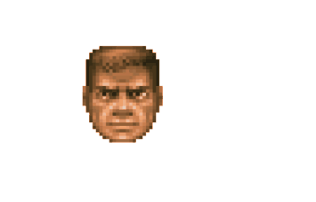
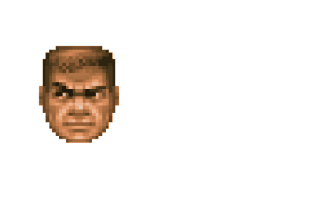

### Fra - functional reactive animation

This repo contains my efforts to implement some concepts of Fran library in ReasonML.
The library allows you to create some basic animations for HTML5 canvas.
The work is in progress, current implementation lacks "reactivity", i.e., it doesn't react to DOM events.
So no interactive animations so far. Some notes regarding my current implementation: https://gist.github.com/ekozhura/2c3558e487e5a4736c1aa16a1e26c09c

Fran was a Haskell library for interactive animations with 2D and 3D graphics and sound.
More information: http://conal.net/fran/

You can find a good explanation and examples of Fran library here: http://conal.net/fran/tutorial.htm

---

To run examples:

`yarn && yarn run build`

Then run web server:

`yarn start`

And open the browser - http://localhost:1234

Check `main.re` for examples of animations

- Horizontal movement:



```js
let waggle = t => 60. *. Js_math.cos(2. *. Js_math._PI *. 2. *. t /. 6000.);

let allTransforms = groupAnim(
    startAt(120., 20.)
    >=> stretchB(const(1.5))
    >=> moveXYB(varied(waggle), const(20.))
    >=> const(staticFace(straight))
    |> speedUp(_ => 2.),
  );
```

- Horizontal movement with look around animation:



```js
let lookAroundB = varied(t => drawSprite(doomFaces, look(5., 4, t)));

let allTransforms = groupAnim(
    startAt(120., 20.)
    >=> stretchB(const(1.5))
    >=> moveXYB(varied(waggle), const(20.))
    >=> lookAroundB
    |> speedUp(_ => 2.),
  );
```
